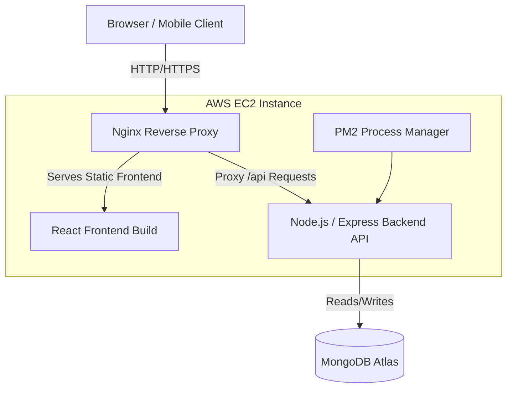

# DSA-Sheet-FullStack — System Design & Database Schema

This document summarizes the high-level system design (HLD), low-level database schema (LLD), API design, scalability considerations, and trade-offs for the DSA-Sheet-FullStack application. It targets an expected workload of 10k–50k active users.

---

## 1. System Design Overview (HLD)
 
### Architecture



### Request Flow
- Client sends HTTPS request to Load Balancer.
- LB routes to a stateless API instance.
- `AuthMiddleware` validates JWT and enforces refresh-token rotation; refresh tokens are persisted server-side in the database for revocation/rotation checks.
- API reads from MongoDB and returns responses directly (no centralized cache in the current deployment).
- Writes (progress updates, submissions) are persisted and relevant events published to MQ for background processing.

### Authentication
- JWT Access Token (short-lived) + Refresh Token (long-lived).
- Refresh tokens stored in HttpOnly Secure cookies and recorded server-side (DB/Redis) for revocation/rotation.
- Passwords hashed with `bcrypt`.
- Role-based claims in JWT for admin endpoints.

### Progress Tracking Data Flow
- Client updates progress (POST `/progress`).
- API upserts `UserProgress` document and updates denormalized counters (user solved count, topic stats).
- API publishes progress event to MQ for asynchronous aggregation (leaderboards, analytics).
- Dashboard reads directly from the database; consider adding a caching layer in future if read latency becomes an issue.

### Scalability Considerations (summary)
- Stateless API servers behind a Load Balancer (ALB) for horizontal scaling; backend runs on EC2 Auto Scaling groups.
- Frontend served from `nginx` on EC2 instances (no CDN in current setup); consider S3+CloudFront for global distribution later.
- No centralized caching layer is used in the current deployment; add Redis or an edge cache when needed for hot data.
- MongoDB Replica Set for HA; shard by `userId` to scale writes if necessary.
- Message queue + workers for heavy/async tasks (aggregation, leaderboards).

---

## 2. Database Schema (LLD)
Design uses MongoDB (documents). Use ObjectId for primary keys. Denormalize where it improves read performance.

### Collections

1) `users`

Document example:
```json
{
  "_id": "ObjectId",
  "email": "string",
  "passwordHash": "string",
  "name": "string",
  "role": "user|admin",
  "createdAt": "ISODate",
  "lastLoginAt": "ISODate",
  "stats": { "solvedCount": 0, "attemptedCount": 0 }
}
```
Indexes:
- Unique index on `email`.
- Index on `lastLoginAt` for active user queries.

2) `topics`

Document example:
```json
{
  "_id": "ObjectId",
  "slug": "string",
  "title": "string",
  "description": "string",
  "problemCount": 0,
  "meta": { "difficultyDistribution": { "easy":0, "medium":0, "hard":0 } }
}
```
Indexes:
- Unique index on `slug`.
- Text index on `title` and `description` for search.

3) `problems`

Document example:
```json
{
  "_id": "ObjectId",
  "title": "string",
  "slug": "string",
  "topicId": "ObjectId",
  "difficulty": "easy|medium|hard",
  "prompt": "string",
  "tags": ["string"],
  "examples": [{"input":"","output":""}],
  "stats": { "solvedCount":0, "attemptCount":0 }
}
```
Indexes:
- Compound index `topicId + difficulty` for filtered lists.
- Text index on `title + prompt`.
- Index on `tags`.

4) `user_progress` (recommended: one document per user-problem)

Document example:
```json
{
  "_id": "ObjectId",
  "userId": "ObjectId",
  "problemId": "ObjectId",
  "topicId": "ObjectId",
  "status": "not_started|in_progress|solved",
  "attempts": 0,
  "lastAttemptAt": "ISODate",
  "lastSubmission": { "language":"js", "code":"..." }
}
```
Indexes:
- Compound unique index on `(userId, problemId)` for fast upserts.
- Index on `(userId, status)` for dashboard queries.
- Index on `(problemId, status)` for problem analytics.

Notes on alternative: a per-user aggregated `progress` document is possible but risks very large documents and update hotspots; the one-document-per-user-problem pattern scales better with sharding.

### Relationships
- `problems.topicId` -> `topics._id` (many-to-one)
- `user_progress.userId` -> `users._id` (many-to-one)
- `user_progress.problemId` -> `problems._id` (many-to-one)

### Indexing Strategy Summary
- Users: unique `email`, index `lastLoginAt`.
- Topics: unique `slug`, text index on `title`/`description`.
- Problems: `topicId + difficulty` compound; text index; `tags` index.
- UserProgress: unique `(userId, problemId)`; `(userId, status)`; `(problemId, status)`; consider partial indexes (e.g., where `status: "solved"`).

---

## 3. API Design (Selected endpoints)

Authentication
- `POST /auth/register` — body `{ email, password, name }` → creates user, sets refresh cookie.
- `POST /auth/login` — body `{ email, password }` → returns access token, sets refresh cookie.
- `POST /auth/refresh` — rotation endpoint using refresh cookie → new access token.
- `POST /auth/logout` — revokes refresh token.

Topics & Problems
- `GET /topics` — list topics (supports `page`, `limit`, `search`).
- `GET /topics/:topicId` — topic details and problem summary.
- `GET /topics/:topicId/problems` — list problems for topic (filters: `difficulty`, `tags`).
- `GET /problems/:problemId` — problem detail.
- `POST /problems` (admin) — create problem.

User Progress
- `GET /users/:userId/progress` — user progress (paginated, authenticated).
- `POST /users/:userId/progress` — body `{ problemId, status, attemptInfo }` → upsert progress.
- `GET /users/:userId/summary` — dashboard summary (cached).

Notes:
- Use cursor-based pagination for large lists.
- Use ETag/Last-Modified headers for caching responses.

---

## 4. Scalability Improvements

- Caching: Redis for hot reads, session/token revocation, rate-limiting counters.
- Async: MQ (RabbitMQ/Kafka) + workers for aggregation, leaderboards, emails.
- DB: MongoDB sharding keyed by `userId` for write scaling; read replicas for analytics.
- Autoscaling: containerized API pods with horizontal autoscaling (K8s HPA) based on CPU/latency.
- Observability: Prometheus metrics, OpenTelemetry tracing, ELK/Graylog logs.
- Security & Rate-limiting: API Gateway + per-user throttling via Redis.

---

## 5. Trade-offs

- Choice of MongoDB:
  - Pros: flexible schema, good write throughput, easy sharding.
  - Cons: limited join capability, eventual consistency for replicas.
- JWT vs server sessions:
  - JWT: stateless, easy scaling, harder revocation.
  - Server sessions: easier revocation, requires central store or sticky sessions.
- Denormalization:
  - Faster reads and simpler queries but increases complexity to keep aggregates consistent. Use background workers for eventual consistency.

---

## 6. System Design Summary & Next Steps

- Goals: support 10k–50k active users with low-latency dashboard reads and scalable progress writes.
- Immediate engineering tasks:
  - Implement API skeleton and auth middleware.
  - Add Mongoose models for `User`, `Topic`, `Problem`, `UserProgress` with indexes.
  - Consider adding Redis caching and server-side token revocation (not used in current deployment).
  - Implement MQ + worker for aggregates.
  - Add monitoring and run load tests (k6) to validate capacity.

If you want, I can now:
- generate Mongoose schemas and index definitions in `backend_dsa_sheet/models`, or
- produce an OpenAPI spec for the endpoints above, or
- add a sequence diagram for the progress update flow.

---

Created by the project design assistant.
